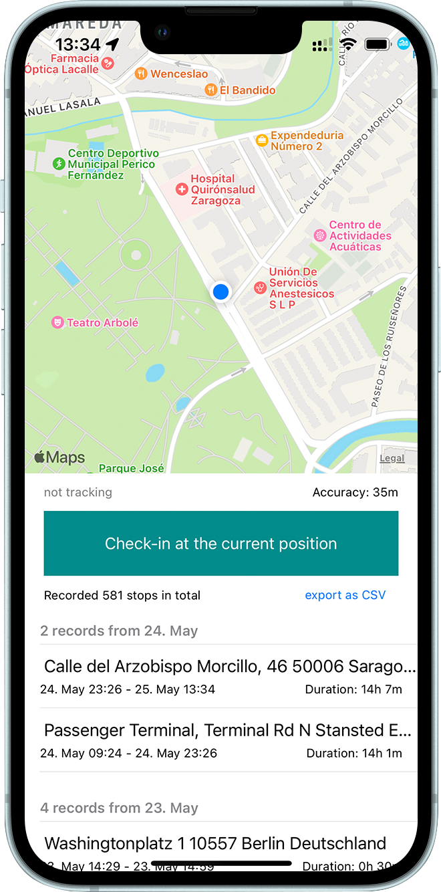

# GPS-Diary

The GPS-Diary is an iOS app for logging stops and trips to create a simple mobility diary. You can use it to manually log the beginning and end of a period of dwelling on one spot. This allows to create a ground truth to, for example, identify significant locations in GPS traces.

This app was designed and used to annotate the STAGA-dataset. You might also be interested in the Stop & Go Classifier, a high-accuracy stop/trip classification system for mobility research. Links to both publications will be made available soon.

- R.P. Spang (spang@tu-berlin.de)